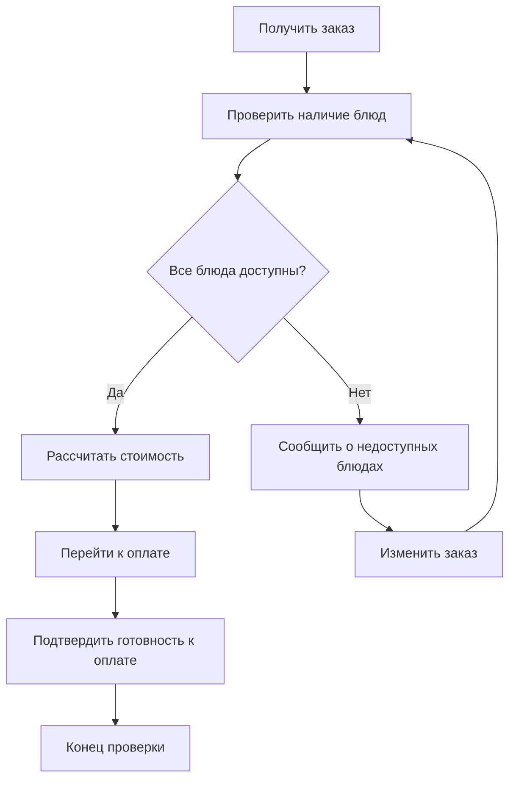

# Flowchart

```mermaid
flowchart TD
    A[Получить заказ] --> B[Проверить наличие блюд]
    B --> C{Все блюда доступны?}

    C -- Да --> D[Рассчитать стоимость]
    D --> E[Перейти к оплате]
    E --> I[Подтвердить готовность к оплате]
    I --> F[Конец проверки]
   
    C -- Нет --> G[Сообщить о недоступных блюдах]
    G --> H[Изменить заказ]
    H --> B
```