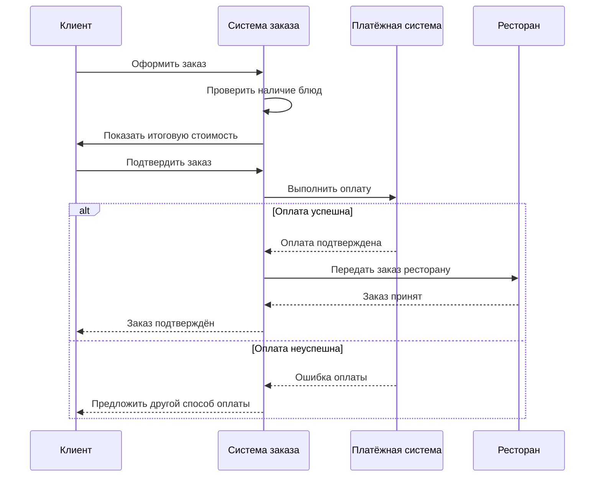

# Sequence Diagram

```mermaid
sequenceDiagram
    participant C as Клиент
    participant S as Система заказа
    participant P as Платёжная система
    participant R as Ресторан

    C->>S: Оформить заказ
    S->>S: Проверить наличие блюд
    S->>C: Показать итоговую стоимость
    C->>S: Подтвердить заказ
    S->>P: Выполнить оплату

    alt Оплата успешна
        P-->>S: Оплата подтверждена
        S->>R: Передать заказ ресторану
        R-->>S: Заказ принят
        S-->>C: Заказ подтверждён
    else Оплата неуспешна
        P-->>S: Ошибка оплаты
        S-->>C: Предложить другой способ оплаты
    end
```