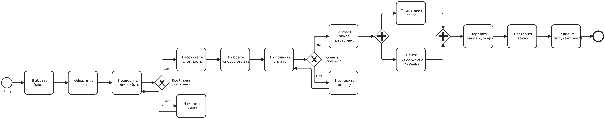
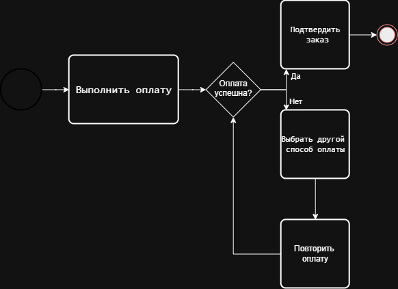
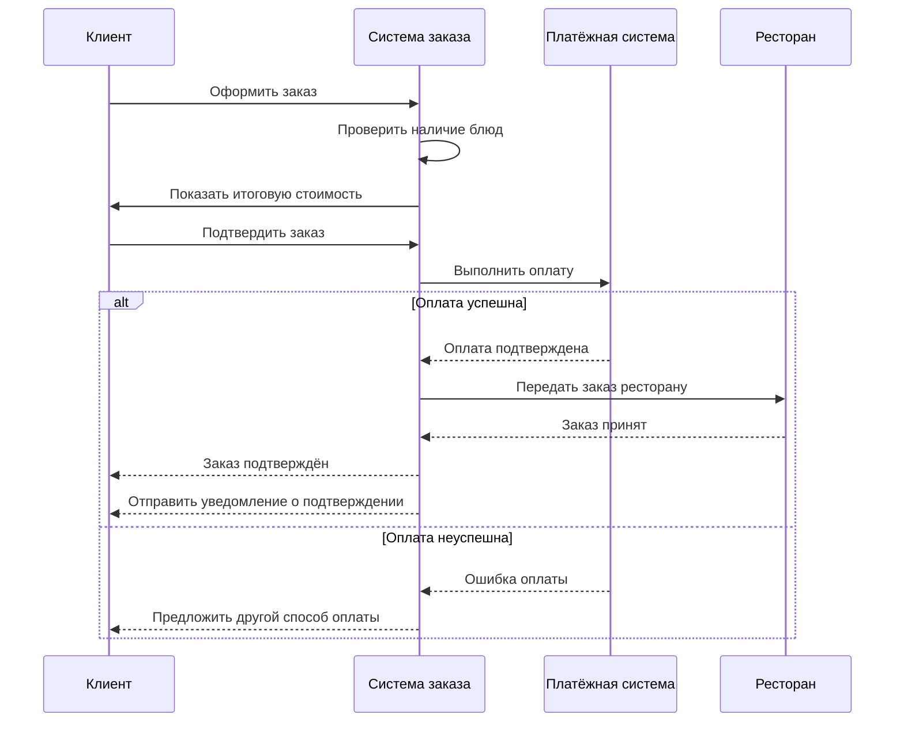
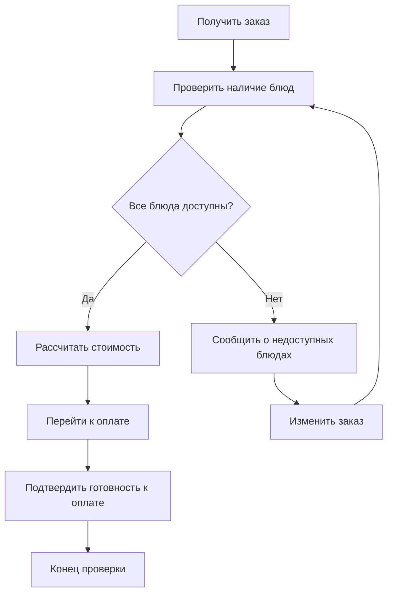

# Лабораторная работа №1

## Моделирование процессов с использованием Git и визуальных нотаций

### Описание процесса

В лабораторной работе рассматривается процесс заказа еды в ресторане с доставкой.

В процессе участвуют клиент, система заказа, платёжная система, ресторан и курьер. Клиент выбирает блюда и оформляет заказ. Система проверяет наличие блюд и рассчитывает стоимость. После успешной оплаты ресторан начинает приготовление заказа, а параллельно система ищет свободного курьера. После приготовления заказ передаётся курьеру и доставляется клиенту.

---

## BPMN Diagram

BPMN-диаграмма показывает полный бизнес-процесс заказа еды, включая проверку наличия блюд, оплату, параллельное приготовление заказа и поиск курьера.

---

## UML Activity Diagram

UML Activity Diagram показывает процесс выполнения оплаты. При неуспешной оплате пользователь может выбрать другой способ оплаты и повторить попытку.

---

## Sequence Diagram

---

## Flowchart

---

## Выводы

В ходе лабораторной работы я научился создавать и хранить разные виды диаграмм в Git-репозитории и отслеживать изменения файлов через Git. Я увидел, что для текстовых форматов, таких как BPMN, draw.io и Markdown, Git может показать конкретные изменённые строки, а для PNG отображается только изменение самого файла. Также я разобрался, чем отличаются BPMN, UML Activity, Sequence Diagram и Flowchart и для каких частей процесса удобнее использовать каждую из этих диаграмм. Работа помогла понять, как можно совмещать визуальное моделирование процессов и контроль версий.